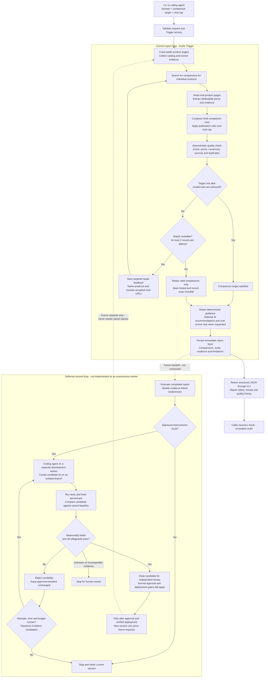

# Market Signal — direct Trigger CLI

Install the CLI, configure your company's Trigger environment API key, and run
research tasks directly in Trigger. No Market Signal website login, workspace
credential, or customer quota is involved.

**[Installation and command instructions](docs/direct-trigger-cli.md)**

```powershell
marketsignal-trigger configure
marketsignal-trigger doctor
marketsignal-trigger report "<domain>" --comparisons 20 --rivals 5 --request-id "<unique-request-id>"
```

Replace every placeholder with your own input. No test store is prefilled.
The comparison count means priced product/rival pairs, not catalog size.
JSON includes comparisons, rivals, evidence, quality checks, and limitations.
The CLI defaults to core comparisons plus deterministic guidance. Optional AI
recommendations and rival website scoring require `--include-analysis`; they
increase latency and may add provider cost. The output explicitly marks these
extras as not requested when omitted. Use the matching worker from this branch.
The report command shows progress and returns its result automatically. Keep it
open; `wait` is only for recovering an interrupted session or explicit background
mode. The two-minute completed-report target is under validation, not guaranteed.

The operator first deploys the direct tasks and sets research-provider
credentials in the company Trigger environment. Colleagues only need the
installed executable and their Trigger environment key after that setup.
Download the matching binaries from the **Direct Trigger CLI** GitHub Actions
artifact for the reviewed commit, or get the ZIP from your company operator.

This branch is independent of the website/customer CLI workflow. The existing
website source remains in the repository but is not used by this executable.
See the guide for the precise validation and deployment boundary; a successful
local test is not proof that the new tasks are installed in your project.

## Loop graph

The first loop runs inside the direct Trigger report task. It can repair the
current draft before returning structured results to the calling CLI or agent.
The second loop is the **future design only: the coding agent is deferred and
is not connected or enabled**. It must not delay a report response or rewrite
an already completed report.



### What is working now

- A comparison is a priced primary-product/rival-product pair, not a crawled
  catalog entry. A primary product can contribute multiple distinct rival pairs.
- The current quality gate checks structural publication rules. Passing it is
  **not** a guarantee of an identical SKU, equivalent pack size, or perfect
  semantic relevance; alternative matches remain inferences.
- Repair feedback targets named products and avoids already accepted rival
  source URLs. It is scoped to the current report, not learning shared across
  future reports.
- Three quality-repair rounds are the maximum **per orchestration attempt**,
  separate from bounded Trigger retries and continuation passes. The diagram
  focuses on report quality, not every transport, access or persistence failure.
  A met comparison target does not erase other report limitations.
- Durable operation receipts and checkpoints avoid repeating completed work;
  ambiguous paid operations stop further paid work. A null AI cost is unknown,
  never zero. Limits and cost caveats are in the [CLI guide](docs/direct-trigger-cli.md).

### What stays for later

The repository already contains a graph contract and pure metric-gate decision
logic, but they do not constitute a deployed, self-improving coding agent. The
deferred design compares relevance, coverage, price/source validity, cost and
runtime against a fixed baseline; it keeps a candidate only through the normal
review and deployment process. Unknown evidence requires human judgment.

Hosting, subscription authentication and unattended-use permissions for the
separate coding worker remain future decisions. This README does not install a
worker, schedule coding jobs, enable paid evaluations or authorize automatic
merges. The current loop improves a report within its bounded run; it does not
change the software or learn between reports on its own.

Implementation references:

- [Shared report orchestration](src/trigger/report-orchestration-core.ts)
- [Direct Trigger workflow runtime](src/trigger-direct/workflow-runtime.ts)
- [Report quality gate and repair feedback](src/shared/report-quality-gate.ts)
- [Graph contract, including the deferred path](src/shared/market-signal-loop-graph.ts)
- [Pure improvement metric gate](src/shared/market-signal-improvement-gate.ts)

Developer checks (not required on a colleague's machine): `npm ci`,
`npm run test:open-source`, `npm test`, and `go -C cli test ./...`.
See [CONTRIBUTING.md](CONTRIBUTING.md) for repository development rules.
