# Task — Market Signal callable loop graph

## Goal

Represent the existing Market Signal report workflow as one callable, typed
function that another authenticated agent can invoke and inspect. Attach a
separate report evaluator and a bounded coding-improvement cycle without
changing the current website, report execution behavior, billing, or customer
data.

This is not a company-level orchestrator. It is the graph contract for one
function: `market-signal.report`.

## Graph

```mermaid
flowchart LR
  caller[Calling agent] --> input[Validate typed input]
  input --> crawl[Crawl primary catalog]
  crawl --> search[Search comparison candidates]
  search --> retrieve[Retrieve source evidence]
  retrieve --> publish[Publish priced comparisons]
  publish --> benchmark[Score accepted rivals]
  benchmark --> actions[Generate grounded actions]
  actions --> persist[Persist report and artifacts]
  persist --> output[Return typed output]
  output --> customerEnd((Customer invocation ends))

  persist -. terminal report .-> evaluate[Evaluate report]
  evaluate --> observe[Approve evidence-linked issue]
  observe -- no candidate --> improvementEnd((Improvement cycle ends))
  observe -- candidate authorized --> implement[Implement distinct candidate]
  implement --> validate[Run checks and fixed benchmark]
  validate --> gate{Metric check}
  gate -- better --> keep[Keep candidate]
  keep --> improvementEnd
  gate -- worse --> revert[Restore approved baseline]
  revert -->|attempt 1-2, distinct hash, budget/deadline open| implement
  revert -- exhausted or bounded stop --> improvementEnd
  gate -- unknown or incomparable --> human[Human review]
  human --> improvementEnd
```

Only the dashed edge crosses from the customer report into the independent
evaluation path. The only back-edge is `revert -> implement`, and its runtime
contract enforces three distinct attempts plus the cycle budget and deadline.

## Existing work represented by the graph

1. Validate a domain, locale, plan, and comparison target.
2. Crawl the submitted public website and collect attributable product pages.
3. Search for rival candidates for the collected products.
4. Retrieve candidate pages and source evidence.
5. Publish only relevant product comparisons with supported prices.
6. Derive rivals from the accepted comparisons and score their public shopping
   experience with the same evidence model.
7. Generate evidence-grounded actions.
8. Persist the full facts and compact owner-private report.
9. Return a bounded typed output and hash-bound references to larger artifacts.
10. Evaluate the terminal report without delaying or mutating it.

## Function boundary

The input contract is fail-closed and versioned. It binds the existing plan to
its comparison target. The terminal output distinguishes complete, limited,
failed, and outcome-unknown states. It returns the private owner path, never a
public share URL. The adapter rebinds request identity, domain, plan, and target
to the validated input so an implementation cannot substitute another run.
Large report, comparison, score, evidence, and evaluation payloads stay behind
content-hashed references.

Every published comparison represented in the function output must have a
supported price. A target shortfall is `limited`, not `complete`.

The existing Trigger report runtime remains authoritative. This task does not
replace its retries, checkpoints, billing, crawler, matcher, or persistence.

## Bounded improvement loop

The customer invocation is finite and ends after returning the terminal report
output. Software improvement is a separate loop across immutable versions:

`approved baseline -> coding candidate -> validation -> metric gate -> keep or revert`

The metric gate compares one candidate against the last approved baseline on a
fixed benchmark version. It has one declared back-edge and permits at most three
distinct candidate attempts. Attempt four is invalid. A cycle-level micro-USD
ceiling and deadline terminate the cycle even before attempt three when reached.

Hard guardrails require tests, type checking, security checks, output-contract
validation, zero empty prices, complete source evidence, and cost/runtime
ceilings. A candidate must improve at least one declared primary metric and may
not exceed any metric's regression tolerance. Unknown or incomparable metrics
stop for human review. A failed candidate restores the approved baseline.

The evaluator proposes evidence-linked issues. It does not modify code, prompts,
the active report, or production configuration. A coding agent may create a
candidate branch from an authorized issue. Keeping a candidate means selecting
it for the normal review workflow; it does not bypass tests, Fable review, or
human/deployment controls.

## Isolation

- Work lives only on `codex/loop-graph-runtime`.
- No website route, component, MCP tool, report worker, database schema,
  deployment manifest, or production setting imports these modules in this
  slice.
- No paid production report is launched for this task.
- Existing real-report evidence may be used read-only to check that the contract
  can represent a real public-domain result.

The no-cost compatibility fixture uses the committed production capture for
`wearform.com` report `64c5c521c41a4b3cb4e60327741b5b66`. It maps the stored
limited report and its 17 accepted priced comparisons into the output contract;
it does not re-crawl the domain or claim that the August capture is current or
high quality. The capture's own manual review is `FAIL` because one inspected
pair has a model-identifier conflict; this test proves schema compatibility,
not report approval.

## Acceptance criteria

1. Exact parsers reject unknown fields, unsupported versions, non-canonical
   domains, plan/target drift, public report paths, unbound artifacts, unknown
   cost represented as zero, and published comparisons without prices.
2. The graph lists the current report work, returns before software improvement,
   and contains exactly one declared improvement back-edge.
3. A better candidate is kept; a worse candidate restores baseline; attempt
   three terminates; attempt four cannot be represented.
4. Duplicate candidates cannot make progress, benchmark-version drift stops for
   human review, and failed hard guardrails cannot be overridden by aggregate
   improvement.
5. Focused tests, type checking, lint, and the existing relevant contract tests
   pass without importing the new graph into the live website.
6. Strict review records the website-isolation boundary and reports no blockers
   before a draft PR is opened.
